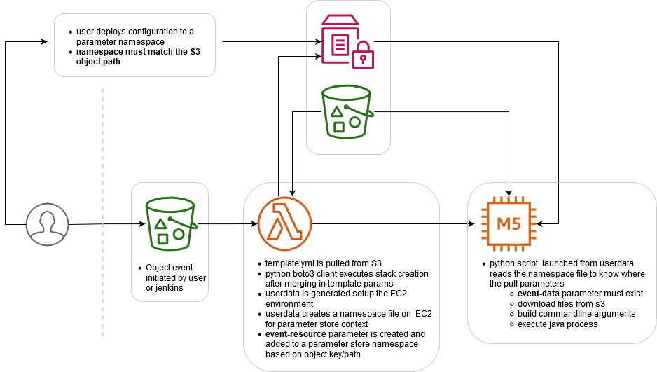

# Data Processing w/ Cloudformation and EC2

An exploratory project to launch an EC2 instance and begin a batch processing job based on some trigger event.

Objectives
 - A new release of the batch component will trigger processing
 - Options to the processing event can be externalized and easily mananged between events

Change information can be found [here](./changes.md).

## Folders
[lambda/](./lambda/) - the lambda function initiating the stack creation event.

[batch-processor/](./batch-processor/) - the java project to perform processing on the EC2 instance

[cloudformation/](./cloudformation/) - contains cloudformation templates

## Dockerfile

Dockerfile is used to create the lambda deployment archive.  AWS Lambda runs on Linux and there are some scenarios where a deployment created on a Windows machine will not run on Linux &ndash; pyopenssl and cryptography to name a few.

The docker build command will create and tag a container.  This command is intended to be run from the project root.

`docker build -t cfn-launch-lambda .`

The `cfn-launch-lambda container` is intended to bind mount the root directory and output the .zip deployment to lambda/build/.  Bind mount allows the archive to be recreated without rebuilding the container image.

The `-v` option binds the current directory to `/usr/share/workspace` on the container.  The container ENTRYPOINT will install and package requirements for the deployment archive.

The command below will run the build container to produce the archive.

`docker run -v "%CD%":/usr/share/workspace cfn-launch-lambda:latest`
